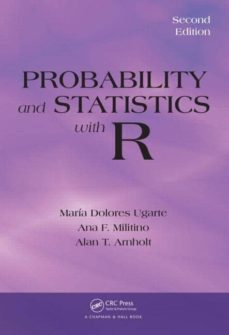

# Programa

## Bioestadística / Curso 2023-24.

| Fecha        | Título                                                                                         |
|--------------|------------------------------------------------------------------------------------------------|
| 09-octubre   | [Práctica 0: Introducción a `R`](./Practica0.html)                                             |
| 09-octubre   | [Práctica 1: Lectura y manejo de ficheros](./Practica1.html)                                   |
| 23-octubre   | [Práctica 2: Estadística descriptiva](./Practica2.html)                                        |
| 31-octubre   | [Práctica 3: Contrastes de hipótesis paramétricos y análisis de la varianza](./Practica3.html) |
| 06-noviembre | [Práctica 4: Pruebas no-paramétricas](./Practica4.html)                                        |
| 13-noviembre | [Práctica repaso: Bloque I](./PracticaRepasoI.html)                                            |
| 14-noviembre | Práctica 5: Regresión lineal                                                                   |
| 27-noviembre | Práctica 6: Medidas de asociación, Odds Ratio y Riesgos Relativos                              |
| 11-diciembre | Práctica 7: Regresión logística                                                                |
| 19-diciembre | Práctica 8: Análisis de superviviencia                                                         |

## Bibliografía

Para la realización de esta práctica, puede consultarse el texto:

Ugarte, M.D., Militino, A.F., and Arnholt, A.T. (2016). *Probability and
Statistics with R (Second Edition)*. Chapman and Hall.

